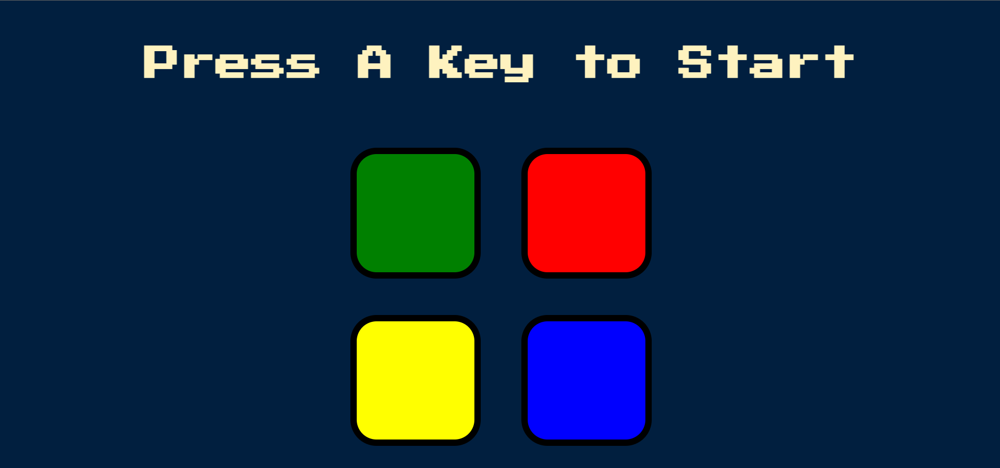
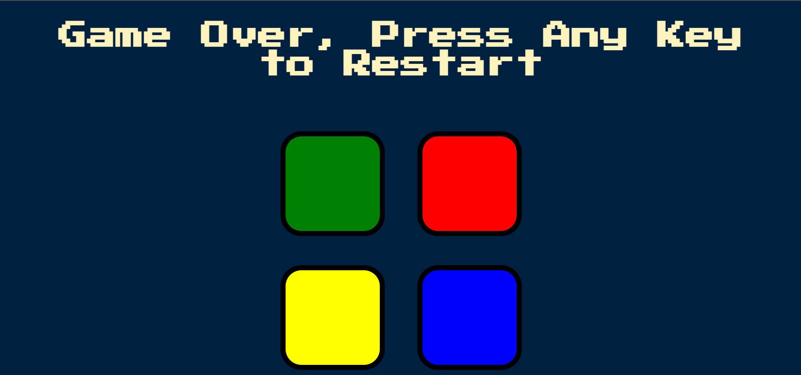

# Simon-Game

This game creates a series of tones and blinks of a button and requires a user to repeat the sequence. If the user succeeds, the series becomes progressively longer and more complex. Once the user fails, the game is over.

# In-game Screenshots

| Game Start | Game Over |
| ----------- | ----------- |
|  |  |

# Link

<a href="https://atharvashirsh.github.io/Simon-Game/" target="_blank" >Visit Game</a>
